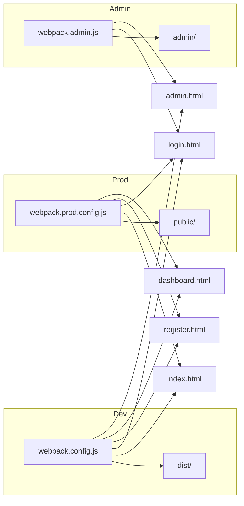

# Limpieza de archivos y preparación para checkout

## Contexto de builds

- **Landing + Dashboard (producción):** `npm run build` → [webpack.prod.config.js](webpack.prod.config.js) → salida en `public/`. Entradas: `main`, `login`, `register`, `dashboard` (sin admin).
- **Admin (producción):** `npm run adminen` → [webpack.admin.js](webpack.admin.js) → salida en `admin/`. Entradas: `admin`, `login`.
- **Desarrollo:** `npm start` → [webpack.config.js](webpack.config.js) → salida en `dist/`. Entradas: `main`, `login`, `register`, `dashboard`, `admin`.
- **Docs:** [webpack.doc.config.js](webpack.doc.config.js) no tiene script en `package.json`; genera solo la home en `docs/`. Opcional.

---

## Archivos que SÍ se usan

### Entradas y HTML

- **JS entrada:** `src/index.js`, `src/js/auth/login.js`, `src/js/auth/register.js`, `src/js/dashboard.js`, `src/js/admin.js`.
- **HTML plantillas:** `src/index.html`, `src/login.html`, `src/register.html`, `src/dashboard.html`, `src/admin.html`.
- **HTML copiados:** `src/offline.html`, `src/uploads/index.html` (prod también copia `uploads/images`, `uploads/blogs`, `uploads/products`).

### JS (por dependencia desde las entradas)

- **Core:** [src/firebase-config.js](src/firebase-config.js), [src/products.js](src/products.js), [src/blogs.js](src/blogs.js).
- **Admin:** `src/js/admin-auth.js`, `src/js/admin-data.js`, `src/js/admin-utils.js`, `src/js/admin-wysiwyg.js`, `src/js/admin-navigation.js`, `src/js/admin-products.js`, `src/js/admin-blogs.js`, `src/js/admin-categories.js`, `src/js/admin-ratings.js`, `src/js/admin-images.js`.
- **Auth/Dashboard:** `src/js/auth/auth-check.js`, `src/js/auth/login.js`, `src/js/auth/register.js`, `src/js/services/authService.js`, `src/js/services/blogService.js`, `src/js/dashboard/blogs.js`, `src/js/dashboard/mixes.js` (import dinámico desde `dashboard.js`).
- **Utilidad:** `src/js/utils/notifications.js`, `src/js/theme-switcher.js` (usado desde `src/index.js`).

### Estilos

- **SCSS:** [src/scss/main.scss](src/scss/main.scss) y todo lo que importa: `theme/tokens.core.scss`, `base/reset`, `typography`, `components`, `theme/theme.patrios`, `theme.comerciales`, `theme.navidad`, `theme.halloween`, y `@import "../styles.css"`.
- **CSS:** [src/styles.css](src/styles.css) (importa `styles/main.css`, `mixes.css`, `productos.css`, `modal-productos.css`, `share.css`, `blogs.css`, `modal-blog.css`, `carrusel-productos.css`, `estrellas-opinion.css`). Además import directo: `styles/notifications.css`, `styles/dashboard.css`, `styles/mixes.css`, `styles/admin.css`.

### Estáticos

- `src/img/` (favicon y assets), `src/site.webmanifest`, `src/uploads/images`, `src/uploads/blogs`, `src/uploads/products`.

### Usado pero no incluido en el build (corregir)

- `**src/forbidden.html`:** lo usa [src/js/admin-auth.js](src/js/admin-auth.js) (`window.location.href = 'forbidden.html'`) cuando un usuario no admin intenta entrar al panel. No está en `CopyWebpackPlugin` ni en prod ni en admin, por lo que en producción esa ruta daría 404. Hay que añadirlo a los dos builds.

---

## Archivos que NO se usan (listado para limpieza)

### Código fuente

| Archivo                             | Motivo                                                                                                                                                            |
| ----------------------------------- | ----------------------------------------------------------------------------------------------------------------------------------------------------------------- |
| **src/js/index.js**                 | No es entrada de ningún webpack; la entrada de la landing es `src/index.js`. Solo importa `main.scss` y `theme-switcher` (incl. `wireThemeUI`). Duplicado/legacy. |
| **src/js/services/tasksService.js** | No está importado en ningún otro archivo. Código muerto.                                                                                                          |
| **src/template.html**               | No se usa como plantilla en ningún HtmlWebpackPlugin ni se referencia en el código. Solo referencia.                                                              |

### Raíz del proyecto (artefactos / debug)

| Archivo                           | Motivo                                                             |
| --------------------------------- | ------------------------------------------------------------------ |
| **debug-herbs.html**              | Página de debug, no parte del build ni de la app.                  |
| **lighthouse-report.report.html** | Reporte estático de Lighthouse.                                    |
| **lighthouse-report.report.json** | Datos del reporte.                                                 |
| **scripts/lighthouse-run.js**     | Script para generar el reporte; opcional si ya no usas Lighthouse. |

### Configuración opcional

| Archivo                   | Motivo                                                                                                                                                                |
| ------------------------- | --------------------------------------------------------------------------------------------------------------------------------------------------------------------- |
| **webpack.doc.config.js** | Build que genera solo la home en `docs/`. No hay script en `package.json` que lo ejecute. Mantener solo si vas a usar un deploy en `docs/`; si no, se puede eliminar. |

---

## Resumen de acciones recomendadas

1. **Limpieza (eliminar):**
  - `src/js/index.js`
  - `src/js/services/tasksService.js`
  - `src/template.html`
  - `debug-herbs.html`
  - `lighthouse-report.report.html`
  - `lighthouse-report.report.json`
  - Opcional: `scripts/lighthouse-run.js` y `webpack.doc.config.js` si no usas docs ni Lighthouse.
2. **Corrección (no eliminar, sino incluir en build):**
  - Añadir `src/forbidden.html` al `CopyWebpackPlugin` en [webpack.prod.config.js](webpack.prod.config.js) (hacia `public/`) y en [webpack.admin.js](webpack.admin.js) (hacia `admin/`) para que el redirect del admin funcione en producción.
3. **Opcional:** En `src/js/theme-switcher.js`, la función `wireThemeUI` solo la usaba `src/js/index.js`. Si borras `src/js/index.js`, `wireThemeUI` queda sin usos; puedes dejarla por si en el futuro quieres un `<select data-theme-select>` en alguna página, o eliminarla en una segunda pasada de limpieza.

---

## Siguiente fase: checkout y pedidos (productos / mixer)

Después de esta limpieza, el siguiente paso que comentaste es una **versión de checkout y pedido en la sección de productos con los mixer**. Eso implicaría:

- Definir flujo: listado productos (mixer) → carrito o “armar pedido” → checkout (datos, envío, pago o “solo pedido”).
- Nuevas páginas o vistas (por ejemplo `checkout.html` + entrada `checkout.js` en webpack prod y dev, y si aplica en admin para ver pedidos).
- Servicio de pedidos (Firestore u otro backend) y posiblemente integración con la lógica actual de productos en [src/products.js](src/products.js).

Cuando quieras, se puede bajar a un plan detallado de pantallas, entradas webpack y estructura de datos para ese checkout/pedidos.